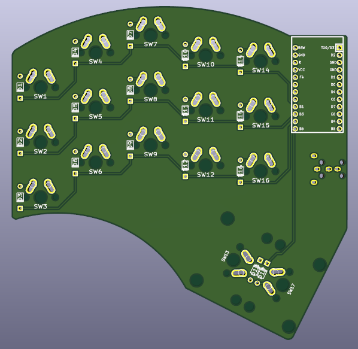
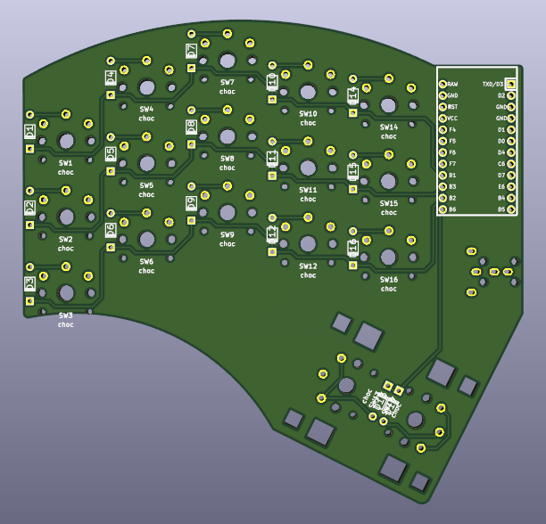
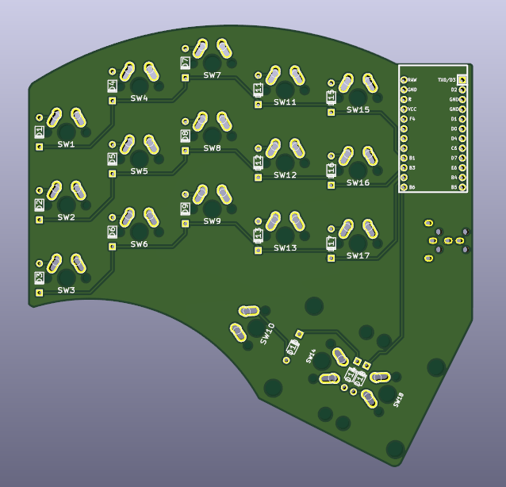
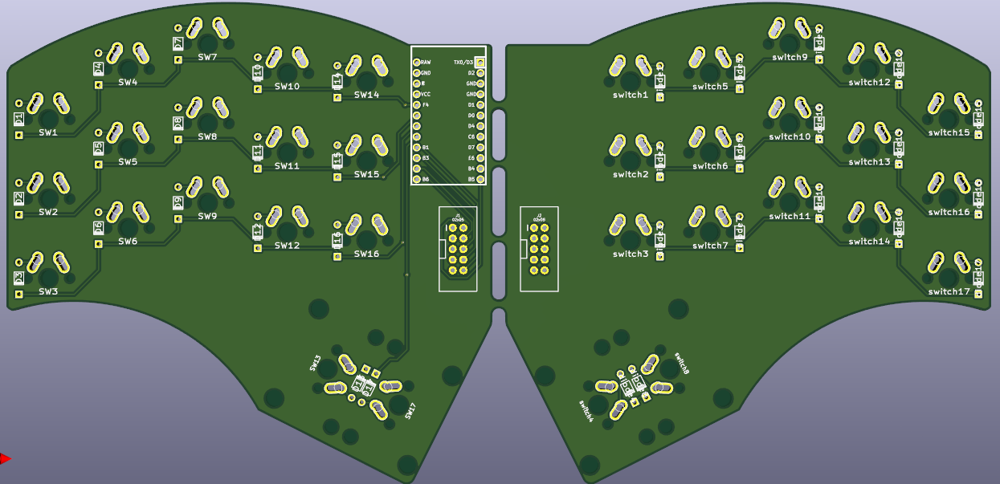
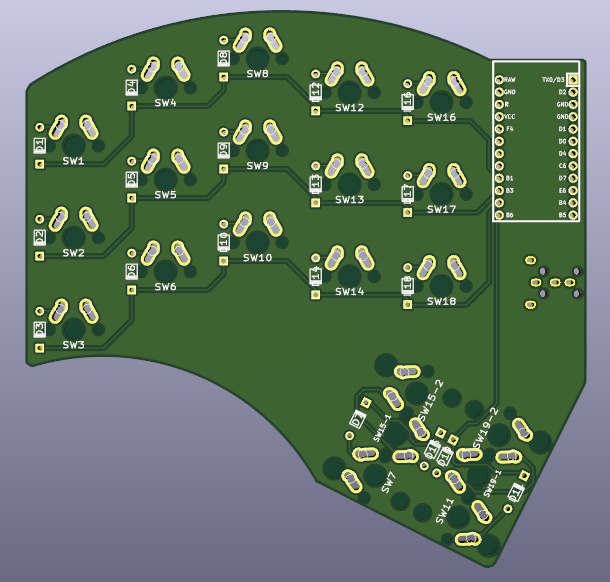
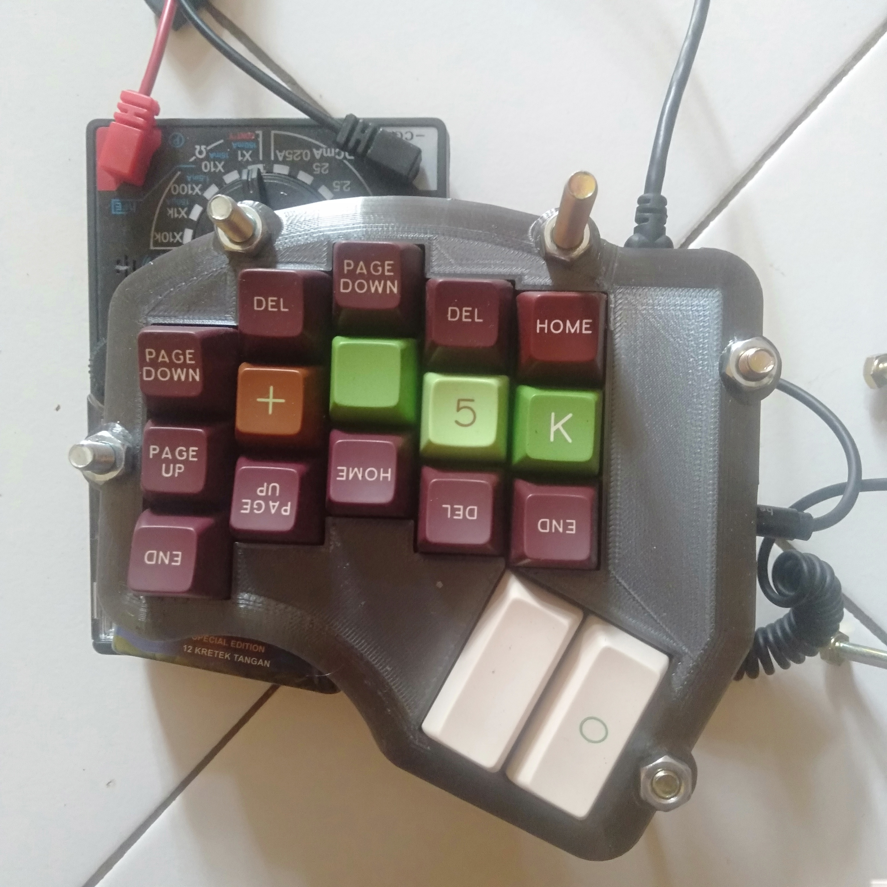
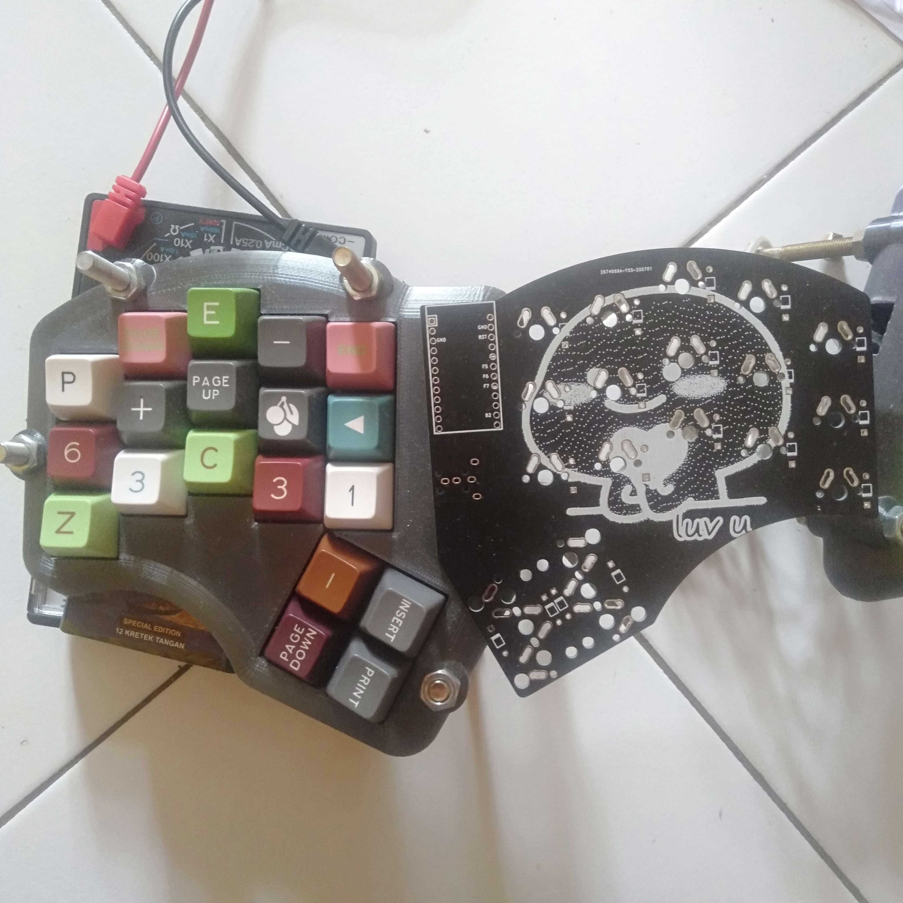
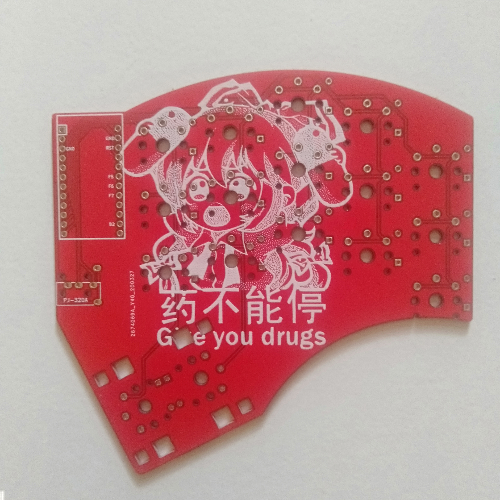
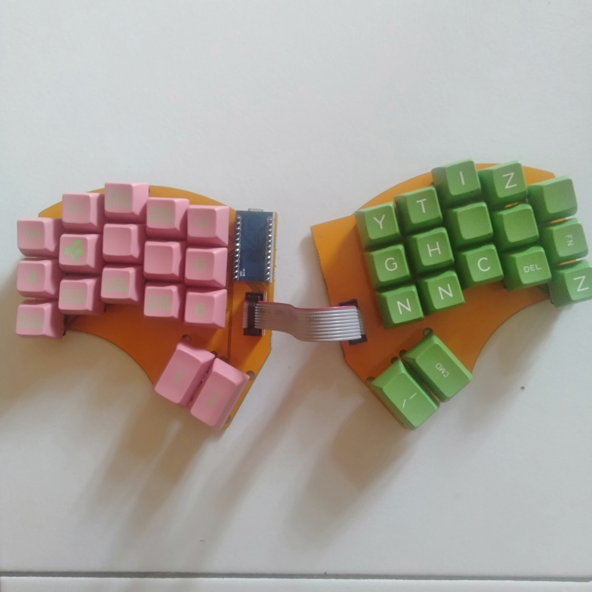

# Squiggle Keyboard

It's a keyboard family which based on my circumstances, preferences, and
observed usages.

Requirements:

- 5 columns per hand.
  My right pinky is almost useless.
- At most 3 keys for each side's thumb row.
  My right thumb key is almost useless.
- No numrow.
  It's harder and more cumbersome to use than a numpad on a layer.
- Split.
  Typing on single flat keyboard hurts my arms in a lot of use cases.
- Symmetric.
  Personal preferences.

This family keyboard repo will not have any of the following features:

- OLED Screen: useless.
- LEDs: useless for me and hurt my eyes.
- Rotary Encoder: useless for me.
- Hotswap: I need a commitment.
- Case for `Low Profile`: defeating the whole purpose of ***LOW*** profile.

## Screenshot

### Standard

- MX and Alps style switches.
- 34 Keys.
- 4x2u thumb keys.
- 2 Promicros.
- TRRS/TRS cable.

### Low Profile

- Dongguan Kaihua Electronics Co., Ltd (originally named Longhua Electronics)'s
  Choc style switches.
- 34 Keys.
- 4x2u thumb keys.
- 2 Promicros.
- TRRS/TRS cable.

### 36 Keys

- MX and Alps style switches.
- 36 Keys.
- 4x2u+2x1.25u thumb keys.
- 2 Promicros.
- TRRS/TRS cable.

### Minimalist

- MX and Alps style switches.
- 34 Keys.
- 4x2u thumb keys.
- 1 Promicros.
- "Amphenol 10 wire" cable.

### Goldberg

(Because it's more complex than necessary. It's just a damn keyboard.)

- MX and Alps style switches.
- 34 - 38 Keys.
- 4x2u or 8x1u thumb keys. (or anything in between)
- 2 Promicros.
- TRRS/TRS cable.

## Confirmed Working PCBs

### Standard

Example firmware: [QMK's master branch](https://github.com/qmk/qmk_firmware/tree/master/keyboards/squiggle/keymaps/rick)

### Goldberg

Example firmware: [QMK's master branch](https://github.com/qmk/qmk_firmware/tree/master/keyboards/squiggle/keymaps/rick-complicated)

### Low Profile

Example firmware: [QMK's master branch](https://github.com/qmk/qmk_firmware/tree/master/keyboards/squiggle/keymaps/rick)

### Minimalist

Example firmware: [Ibnuda's fork](https://github.com/ibnuda/qmk_firmware/tree/squiggle-minimalist/keyboards/squiggle_minimalist/keymaps/rick)

## Disclaimer

I haven't printed some of it. But, theoretically, they should just work.
Oh, if things go wrong, I won't take any responisibilities.

## Additional Note

Any files with `mokou_*.kicad_mod` in `libs/footprints` are made by [Jokan Hiyou](https://twitter.com/jokanhiyou)
and belong to hers.
I just dither them and made them kicad footprints.

## License

GPLv3.
